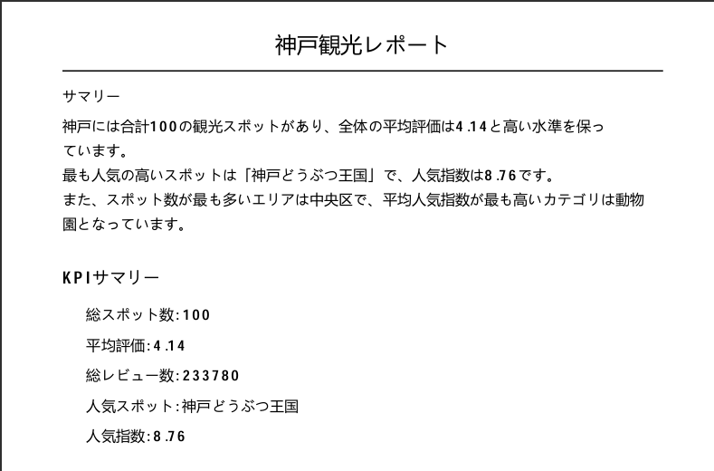
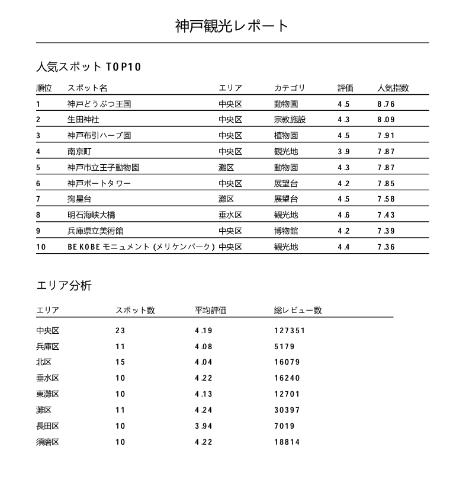
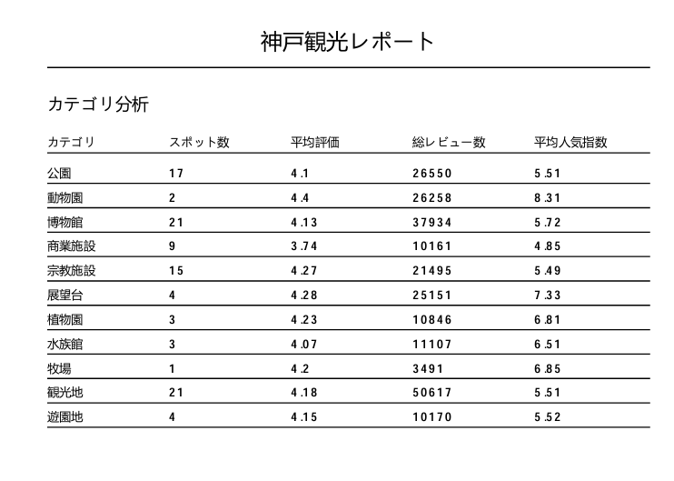
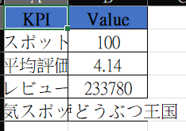
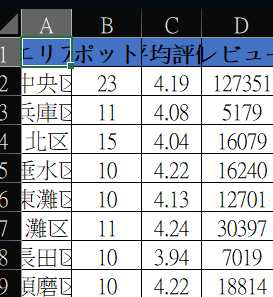
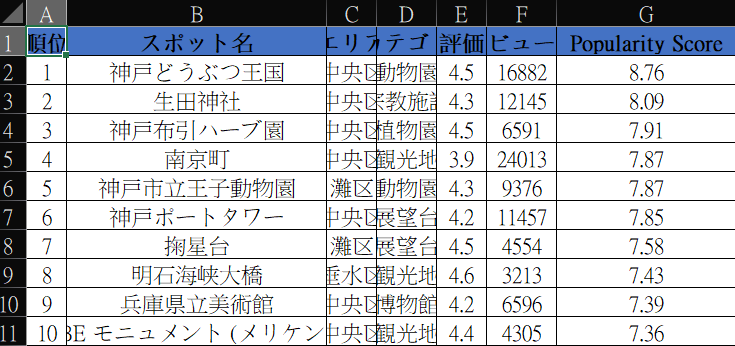

# 神戸観光レポート自動生成ツール

## プロジェクト概要

神戸市内の観光スポットデータを分析し、ExcelレポートおよびPDFレポートを自動生成する業務支援ツールです。

観光スポットの評価・レビュー数を分析し、KPI、エリア分析、カテゴリ分析、人気スポットランキングを自動作成します。

また、OpenAI APIを活用したAI分析サマリー機能により、データ分析結果を自然な日本語で要約し、PDFレポートへ出力します。

本プロジェクトは、日本企業の業務システム開発を想定し、データ分析、自動化ツール開発、およびAI活用スキルを示すことを目的として開発しました。

---

## 制作背景

前作「神戸観光ダッシュボード」では、神戸市内の観光スポットデータを可視化し、KPI分析やエリア分析を実装しました。

本プロジェクトでは、その分析結果を活用し、ExcelおよびPDFレポートを自動生成する仕組みを構築しました。

実際の業務システムで利用されるレポート作成業務を想定し、自動化ツールとして開発しています。

---

## 主な機能

* KPI自動集計
* エリア分析
* カテゴリ分析
* 人気スポットTOP10分析
* 人気指数算出
* Excelレポート自動生成
* PDFレポート自動生成
* OpenAI APIによるAI分析サマリー生成

---

## 使用技術

### バックエンド

* Python
* Pandas
* NumPy

### Excel出力

* OpenPyXL

### PDF出力

* ReportLab

### AI

* OpenAI API
* GPT-4o-mini

### 開発ツール

* Git
* GitHub
* VS Code

---

## システム構成

```text
Excel Data
    ↓
Data Loading
    ↓
Data Analysis
    ↓
KPI Calculation
    ↓
Popularity Score Calculation
    ↓
Area Analysis
    ↓
Category Analysis
    ↓
Top10 Ranking
    ↓
OpenAI AI Summary
    ↓
Excel Report Output
    ↓
PDF Report Output
```

---

## プロジェクト構成

```text
kobe-tourism-report-generator/

├── data/
│   └── kobe_tourism_spots.xlsx
│
├── output/
│   ├── kobe_tourism_report.xlsx
│   └── kobe_tourism_report.pdf
│
├── src/
│   ├── load_data.py
│   ├── analyze_data.py
│   ├── excel_report.py
│   ├── pdf_report.py
│   └── ai_summary.py
│
├── main.py
├── requirements.txt
├── .gitignore
└── README.md
```

---

## 分析機能

### KPI分析

自動計算項目

* 総スポット数
* 平均評価
* 総レビュー数
* 人気スポット
* 人気指数

### 人気指数

以下の独自指標を利用しています。

```python
(rating / 5) * log(review_count + 1)
```

評価点とレビュー数を組み合わせることで、単純な評価順位ではなく人気度を算出しています。

### エリア分析

分析項目

* スポット数
* 平均評価
* 総レビュー数

エリアごとの観光資源の分布を分析します。

### カテゴリ分析

分析項目

* スポット数
* 平均評価
* 総レビュー数
* 平均人気指数

カテゴリごとの人気傾向を分析します。

### 人気スポットTOP10

人気指数を利用して人気スポットランキングを自動生成します。

---

## AI分析サマリー機能

OpenAI API（GPT-4o-mini）を利用して分析結果を要約します。

入力データ

* KPI分析結果
* エリア分析結果
* カテゴリ分析結果

出力例

```text
神戸市内の観光スポット100件を分析した結果、
中央区は最も多くの観光スポットを有しており、
神戸観光の中心エリアであることが分かりました。

また、動物園カテゴリは平均人気指数が最も高く、
観光客から高い関心を集めていることが確認されました。
```

---

## 出力レポート

### Excelレポート

生成内容

* KPI Summary
* Area Analysis
* Category Analysis
* Top10 Ranking

### PDFレポート

生成内容

* AI分析サマリー
* KPI Summary
* 人気スポットTOP10
* エリア分析
* カテゴリ分析

ページ番号付きのレポートとして出力します。

---

## 画面イメージ

### PDFレポート



---



---



### Excelレポート



---



---



---

## 工夫した点

* Popularity Scoreを独自設計し、評価点とレビュー数を組み合わせた人気度分析を実装
* Pandasを活用した自動集計処理を実装
* OpenPyXLによるExcelレポート自動生成
* ReportLabによるPDFレポート自動生成
* OpenAI APIを利用したAI分析サマリー機能を実装
* モジュール分割による保守性向上

---

## 今後の改善点

* グラフ付きPDFレポート生成
* CSVアップロード対応
* Web UI追加
* メール自動送信機能
* 多言語レポート生成
* BIダッシュボード連携

---

## 本プロジェクトで活用したスキル

### データ分析

* Pandas
* NumPy
* KPI設計
* データ集計

### 自動化

* OpenPyXL
* ReportLab
* レポート自動生成

### AI

* OpenAI API
* Prompt Engineering
* AI要約生成

### バックエンド開発

* Python
* モジュール設計
* 業務システム開発

### 開発ツール

* Git
* GitHub
* VS Code

```
```
